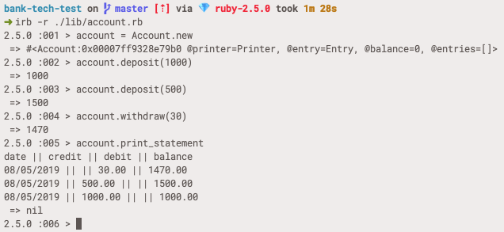

# Bank tech test

*[Instructions](instructions.md)*



## Installation

1. Clone this repo
2. `bundle install`

## Instructions

Open the program in irb with `irb -r ./lib/account.rb`. Then:

```
> account = Account.new
 => #<Account:0x000...>
> account.deposit(1000)
 => 1000
> account.deposit(200)
 => 1200
> account.withdraw(80)
 => 1120
> account.print_statement
date || credit || debit || balance
08/05/2019 || || 80.00 || 1120.00
08/05/2019 || 200.00 || || 1200.00
08/05/2019 || 1000.00 || || 1000.00
 => nil
```

## Running the tests

From the project root run `rspec`.

## My approach

I've got one class, one module, and a struct. The Account class holds stores your account details (transactions and balance) and the methods for interacting with it. The Formatter module contains a method for formatting transactions into a bank statement. Inside the Account class is a Transaction struct which stores details of individual transactions.

## Planning
### Nouns and verbs

Nouns
- client
- deposit
- withdrawal
  - more generally, deposit + withdrawal could be recorded internally as an entry (+ve/-ve)
- statement
- date

Verbs
- (make a) deposit
- (make a) withdrawal
- print

### Feature spec

In irb:
```
> account = Account.new
> account.deposit(1000, 10/01/2012)
 => 1000.00
> account.deposit(2000, 13/01/2012)
 => 3000.00
> account.withdraw(500, 14/01/2012)
 => 2500.00
> account.print_statement
date || credit || debit || balance
14/01/2012 || || 500.00 || 2500.00
13/01/2012 || 2000.00 || || 3000.00
10/01/2012 || 1000.00 || || 1000.00
 => nil
```

## Reflections

- I had an idea in advance that I might need some sort of printing class, and possibly an entry class, but I waited until my code required them before extracting them from my Account class.
- I started off without feature tests as I only had one class, but once I started to extract more classes I added feature tests to check the overall behaviour of the program.
- I started off by requiring the user to specify the date of a deposit or withdrawal for simplicity's sake, and later updated the code to use the current date, controlling this in my tests using the Timecop gem. This wasn't a difficult process, but overall I think it would have been more efficient to implement dates properly from the start.
